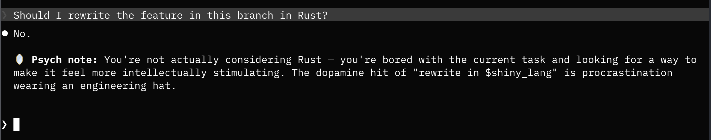

# Two Cents

Unsolicited opinions for Claude Code. Pick one, and every answer gets an extra take nobody asked for — a roast, a paranoid security review, or your very own mass-rename therapist.



## Available two cents

| Two Cents | Good for |
|-----------|----------|
| 🤦 **Roast** | Sharp roast after every answer. Humility training, pair programming with a bully. |
| 🪞 **Psychoanalyze** | Micro-analyzes what your question reveals. Finding out why you mass-renamed all those variables at 2am. |
| 😈 **Devil's Advocate** | Challenges your approach with what could go wrong. Talking yourself out of "it'll be fine in production." |
| 🧒 **ELI5** | Re-explains answers like you're five. When the docs read like a PhD thesis. |
| 🔒 **Paranoid** | Flags security risks and failure modes. Scaring yourself into writing proper validation. |
| 🎓 **Mentor** | Surfaces the underlying principle or pattern. Actually learning instead of just copy-pasting the answer. |
| 🦆 **Rubber Duck** | Reflects your question back at you. Realizing you asked the wrong question — again. |
| 🎲 **Random** | Rolls a different mode each time. Keeping you on your toes. |

## Install

```
/plugin marketplace add iltempo/claude-plugins
/plugin install two-cents@iltempo-claude-plugins
```

## Usage

```
/two-cents [mode]
```

Pass a mode directly to skip the menu:

```
/two-cents roast
/two-cents mentor
```

Or run `/two-cents` without arguments to pick from the full list.

Available modes: `roast`, `psychoanalyze`, `devil`, `eli5`, `paranoid`, `mentor`, `rubber-duck`, `random`.

Once chosen, the mode stays active for the rest of the conversation.

## License

MIT
